# BeastMemory

**Welcome to BeastMemory!** 🧠🐾

**BeastMemory** is a mysterious memory card game adorned with enigmatic and otherworldly animal spirits, perfect for all ages and an excellent tool for enhancing memory skills.

**Key Features:**

- **Enchanting and Otherworldly Beasts 🐾**
  Delve into a realm filled with mystical and captivating creatures that are shrouded in an aura of magic.
- **Bewitching Experience for All Ages 🌟**
  An ethereal adventure that binds both young and old, making it the perfect activity for gatherings under the moonlit night.
- **Cognitive Rehabilitation 🧠**
  Beyond entertainment, traverse this spectral journey to refine your concentration, focus, and memory—especially beneficial for those in cognitive recovery.
- **Integrated with Telegram Bots API 🤖**
  Featuring a native Telegram button, the game provides a seamless user experience, allowing you to dive right into the mystical world directly from the Telegram app.
- **Cross-Platform Gameplay ☁️**
  Thanks to CloudStorage API, share your magical BeastMemory experience across different devices. Never lose progress and continue your cognitive enhancement journey wherever you go.
- **Progress Tracking 📊**
  Utilizing CloudStorage API also allows you to track your memory enhancement progress, a crucial feature for those in recovery from serious diseases.

🎮 **Play Now**:

- [Telegram WebApp](https://t.me/BeastMemoryBot/game), click on the link or find our bot in Telegram `@BeastMemoryBot`
- [Web](https://js-headquaters.github.io/beast-memory-game/), remember that the application was developed for mobile devices and to operate within the context of Telegram

## Our Contacts

**Konstantin Poleshchuk**

- [github](https://github.com/jsCommander)
- [linkedin]()
- [telegram](https://t.me/jscommander)
- [gamedev chanel](https://t.me/gamedev_batya)

**Vladislav Sharikov**

- [github](https://github.com/sharikovvladislav)
- [linkedin]()
- [telegram](https://t.me/vladsharikov)

## Table of Contents

1. [Running BeastMemory Locally](#running-beastmemory-locally)
2. [The Road to Creation](#the-road-to-creation)
3. [Technology Stack](#technology-stack)
4. [Dive into Project Details](#dive-into-project-details)
5. [Creating Art with Midjonery](#creating-art-with-midjonery)
6. [Feedback on Developing Telegram's WebApp](#feedback-on-developing-telegrams-webapp)

## Running BeastMemory Locally

Before starting, ensure you have `git` and `Node.js` installed on your machine. If not, you can download and install them from the following links:

- [Install Git](https://git-scm.com/book/en/v2/Getting-Started-Installing-Git)
- [Install Node.js](https://nodejs.org/en/)

Follow these simple steps to run BeastMemory on your local machine:

1. **Clone the Repository**
   Start by cloning the project repository by running the following command:

   ```bash
   git clone https://github.com/js-headquaters/beast-memory-game.git
   ```

2. **Install the Dependencies**
   After cloning the repo, navigate to the project directory and install the necessary dependencies with:

   ```bash
   npm ci
   ```

3. **Run the Project**
   Launch the project in development mode with:

   ```bash
   npm run dev
   ```

4. **Access the Project**
   The project will be available at [http://localhost:5173/](http://localhost:5173/).

Thank you for taking an interest in BeastMemory. When you run this project on your local machine, please note the following:

**Telegram Bots API Limitation ℹ️**: Due to running outside the Telegram environment, features relying on the Telegram Bots API will be disabled.

**Fallback Features 🔄**: To compensate for the lack of Telegram Bots API features, we have implemented fallbacks:

HTML buttons will be used as an alternative interface.
Data will be stored in the browser's LocalStorage.
Feel free to explore and experiment with BeastMemory on your local setup!

### Debug menu

There is a debug menu available. To enter a debug mode:

1. Start the game
2. Go to the Statistic page
3. Click on the Statistic header 10 times

In the debug mode, you can:

- change levels to test different test cases
- change theme (light and dark) immediately
- reset statistic

## The Road to Creation

👋 Hi everyone! My name is Konstantin Poleshchuk. Together with my friend Vladislav Sharikov, we created this game. Below you'll find the story of how it all came together, our trials and tribulations, and how we overcame every obstacle in our journey to build this project. I hope you find it intriguing!

### Introduction

It's always been a challenge for me to see things through. Like many developers, I'd get excited about an idea, create a prototype, and then my attention would wane. There were so many projects that felt pointless. However, everything shifted when my wife suffered a stroke. This period was tough, and we worked tirelessly to recover her memory. The most helpful exercise was matching paired cards. I realized most apps out there were overly complicated when we just needed something straightforward. So, when Vlad shared information about the competition, I knew this was my calling.

### Prototype and Hurdles

Building a prototype was straightforward – after all, I was a web developer. But design? That was another story. My wife adores bright colors, and I wanted to craft something special for her. I had no artist contacts, and hiring a professional would cost a fortune, not to mention the uncertainty of tight deadlines. Doubts about the project's viability began to cloud my mind.

### Light at the End of the Tunnel

Recalling my previous unsuccessful attempt at using neural networks for game sprites, I decided to give them another shot. After all, creating static arts is much simpler than animations. Initial attempts were flawed: the arts generated were stylistically inconsistent, leading to on-screen chaos. While individual pieces looked great, they didn’t gel together. After much trial and error, it felt like achieving a cohesive style was an elusive dream. However, I eventually managed to pin down a consistent style. The breakthrough was achieved! More details on the process can be found in the generation section.

### The Final Push

Even with the arts ready and the prototype functioning, the daunting task of refinement lay ahead. This phase has always been my Achilles' heel. This is when Vlad became my anchor. He tested, gathered feedback, suggested improvements, and simply stood by my side. Thanks to his assistance, we concluded the project, leaving a couple of brilliant ideas for the future while concentrating on meticulous testing of what was already crafted.

### Deployment: GitHub Pages

For deployment, we selected [GitHub Pages](https://pages.github.com/) since our game does not require server interactions. GitHub Pages offers us:

- **Effortless Deployment**: Avoid the hassle of VPS rental and HTTPS certificate setup.
- **Automatic Deployment**: On repository push, thanks to [GitHub Actions](https://github.com/features/actions), keeping the game updated is seamless.

The deployment script can be found [here](.github/workflows/deploy.yml).

By choosing these technologies and platforms, we ensure an efficient, enjoyable, and productive development and gaming experience with **BeastMemory**.

## Dive into Project Details

### Let's Get Started: Simple Steps

If you're just diving in, here’s the quick path:

1. **Understand the Game Mechanics**: Start with [`GameStateService`](src/services/game-state.service.ts).
2. **See the Game**: Jump to [`GameFieldComponent`](src/components/game-field/game-field.tsx) and see how it comes alive.
3. **Explore Individual Elements**: Visit [`GameCardComponent`](src/components/game-field/game-card/game-card.tsx) to understand how each card flips and interacts.

### Services

Now, let's peel back the layers and see what makes our game tick in the background:

- **[`GameStateService`](src/services/game-state.service.ts)**: The maestro of our game, orchestrating everything that happens, from the shuffle of the cards to what happens when a pair is matched.
- **[`StatisticService`](src/services/statistic.service.ts)**: This service acts as the game's memory, storing data from previous games and calculating average statistics for overall performance.
- **[`ThemeService`](src/services/theme.service.ts)**: This service helps switch themes. It keeps the current theme's details and sets the right CSS for the whole game, making sure it looks good.

### Components

And now, let's have a closer look at our game's visible parts:

- **[`GameFieldComponent`](src/components/game-field/game-field.tsx)**: This component manages the main game layout. It organizes and adjusts the game field to display all cards optimally based on screen size.
- **[`GameCardComponent`](src/components/game-field/game-card/game-card.tsx)**: Represents an individual game card. Handles card flipping animation and displays the card's front and back designs.
- **[`GameOverComponent`](src/components/game-over/game-over.tsx)**: Displayed after the game ends. It presents the end-of-game statistics.
- **[`StatisticComponent`](src/components/statistic/statistic.tsx)**: Provides an overview of previous game results and displays average gameplay statistics.

## Creating Art with Midjonery

I had already gained some experience in crafting game art when I attempted to create complex animated sprites (you can find more details on my [channel](https://t.me/gamedev_batya). However, creating character animation proved to be more challenging than anticipated, and I couldn't achieve satisfactory results.

### First Steps with Midjonery

I decided to give simpler art a try. So, I invested $10 in Midjonery and began experimenting. My initial idea was to generate a cute anime-style cat and use it as a reference. I effortlessly acquired a cat image.

`anime cute cat, with smiling face, sitting and facing forward, сhubby, --ar 9:14`
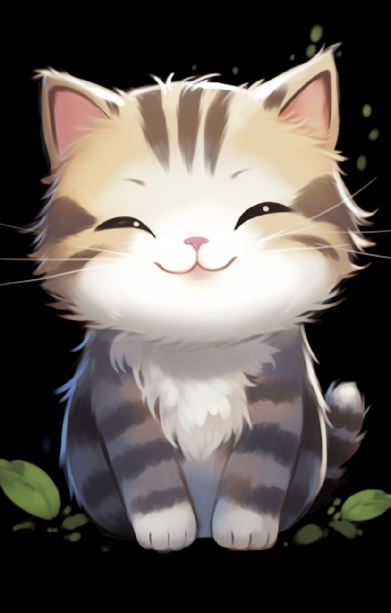
This cat set the benchmark: building upon it, I managed to craft an impressive dog in the same style. But when I tried using this reference for a frog, the outcome was... a green cat that faintly resembled a frog.

`cartoon frog, kawai, smiling, funny, black background, white outline --ar 9:13 --no text`
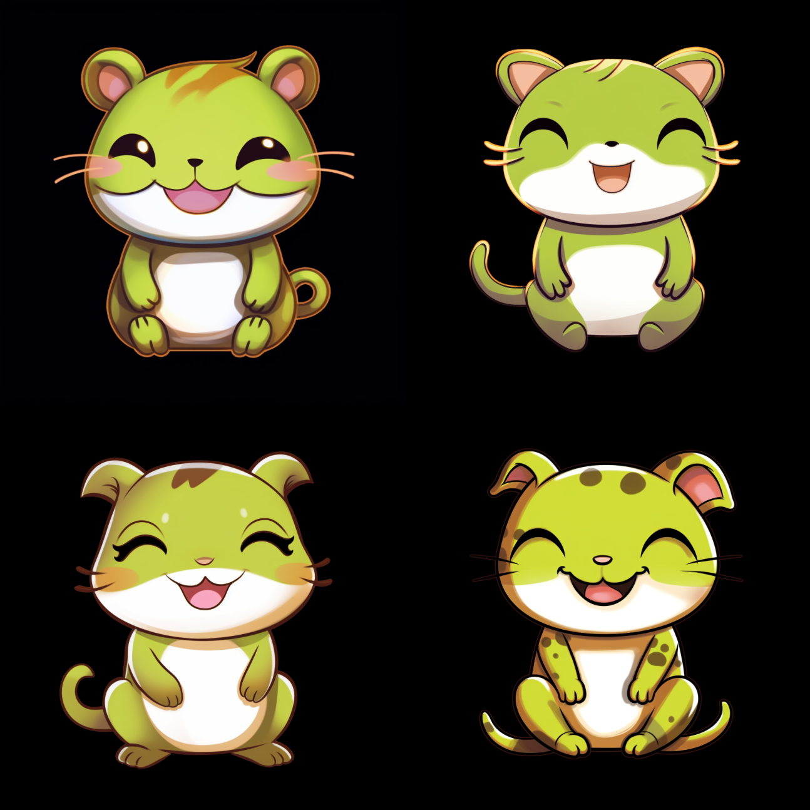

### Using Diverse Cartoon Shows as References

After unsuccessful attempts at crafting other animal art using the cat as a reference, it became clear that I needed a different approach. The problem was that while I wanted to retain the cat's aesthetic for other animals, the neural network perceived the specific features of the cat as part of the style, making it challenging to generate a recognizable frog, for instance.

I then opted to use frames from my favorite cartoons "Steven Universe" and "Adventure Time" hoping that showcasing multiple characters in a single image would help the neural network grasp the overall style without fixating on specific character details. This method proved to be quite successful: the animals began to look more expressive and in the desired style.

`individual digital asset, cartoon wolf, with smiling face, sitting and facing forward, сhubby, black background, --ar 9:13 --no text --no shadows`
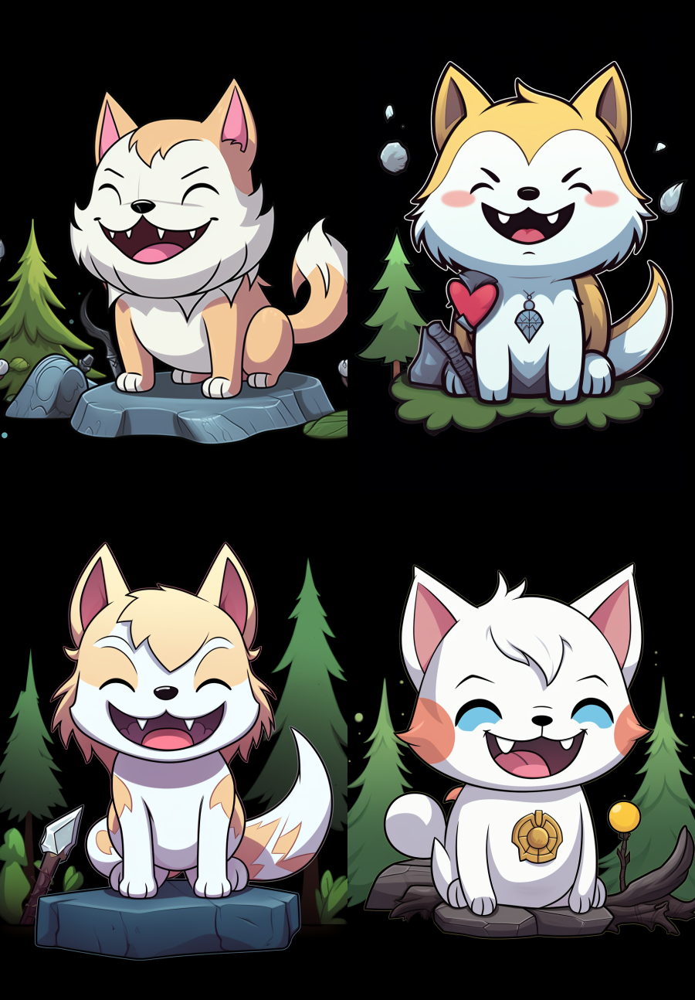

`individual digital asset, cute cat, with smiling face, sitting and facing forward, сhubby --ar 9:13 --no text --no shadows`
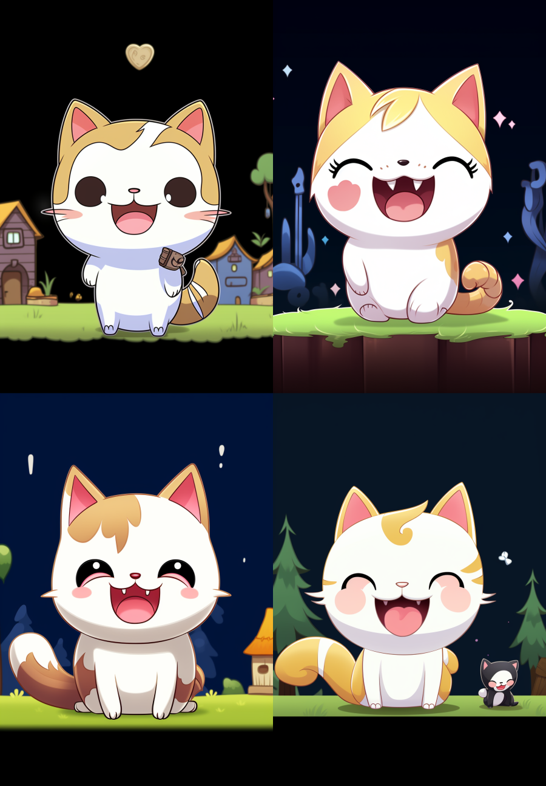

`cute cartoon cat, black background  --ar 9:13 --no text --no shadows`
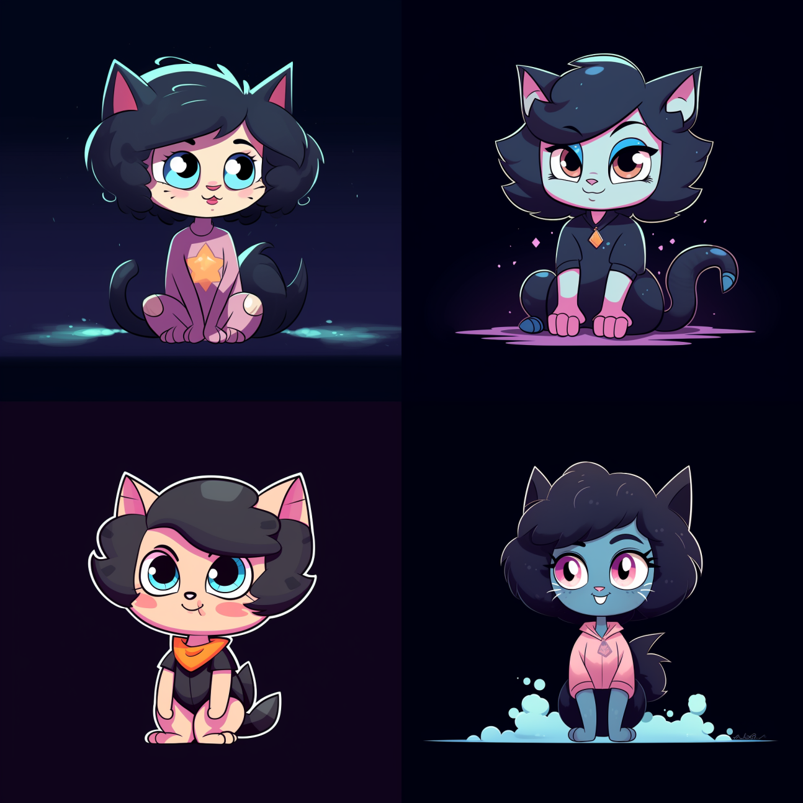

However, a new challenge arose in an area I hadn't anticipated – the background of each image. Despite my explicit prompts like "transparent background" or "black background", the neural network would overlook them, producing backgrounds of various colors and textures every time. It's worth noting, though, that while not meeting my specific requests, the backgrounds crafted by the network were genuinely creative and colorful. Yet, their differences became too prominent and disrupted the overall perception when all the arts were showcased on a single screen.

### Hallucinations as the Solution

Recognizing the inconsistency in the backgrounds, I sought a way to harmonize them when viewed collectively. My idea was to embrace an overarching theme that would bridge these disparities. An epiphany struck: what if I gave all the arts a touch of mysticism and psychedelia? Such backgrounds would differ, but they'd be unified under a single theme – enigmatic realms and creatures. With this in mind, adding words like "fractals" and "lsd" to the prompt, I indeed began to see impressive results.

`digital asset, cute cat, fractals, lsd --ar 9:13 --no text --no shadows`
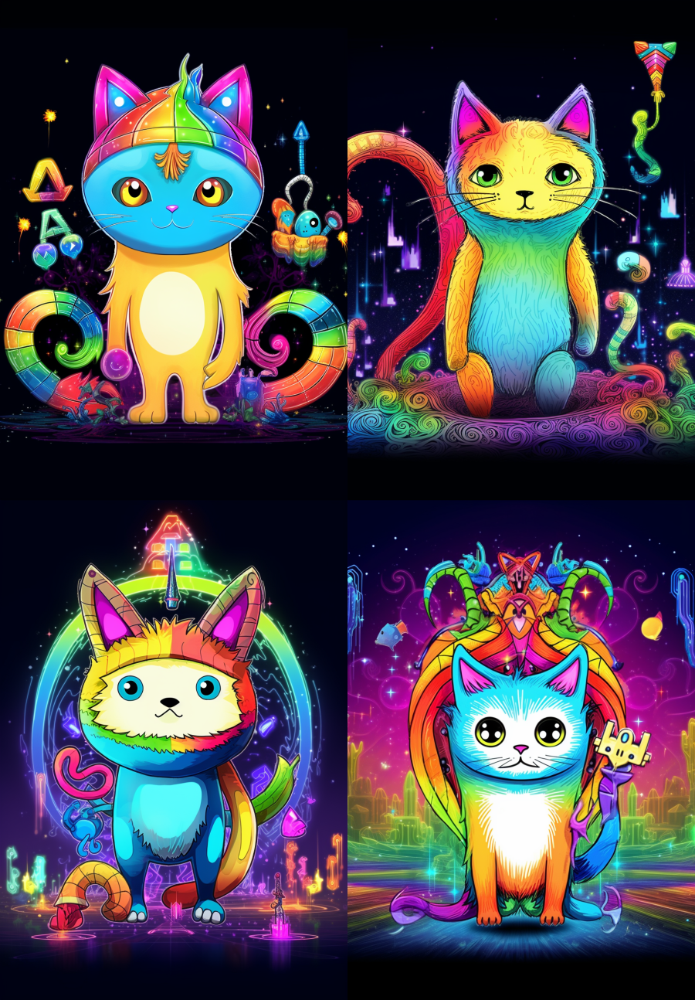

`digital asset, cute cartoon pig, fractals, lsd --ar 9:13 --no text`
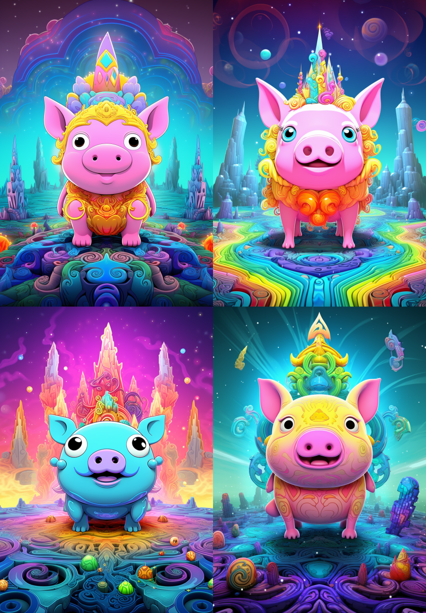

`digital asset, cartoon chicken, chicken, chicken, fractals, lsd --ar 9:13 --no text`
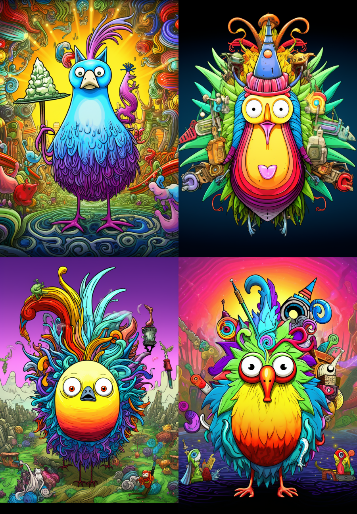

Soon, it became evident that this approach could be further refined by multiple generations and basic post-processing in a graphic editor, like Gimp, which I used.

### Selecting the Right Images

The method worked, but finding suitable images was not straightforward. I often revisited the same animal, trying to achieve the desired outcome. For instance, with the crab, I spent about 50 generations, and despite all my efforts, I couldn't get the right art piece. All these attempts at grappling with the neural network meant that I quickly exhausted the hours allocated to me for generation.

`digital asset, cartoon crab, cartoon crab, cartoon crab, fractals, lsd --ar 9:13 --no text`
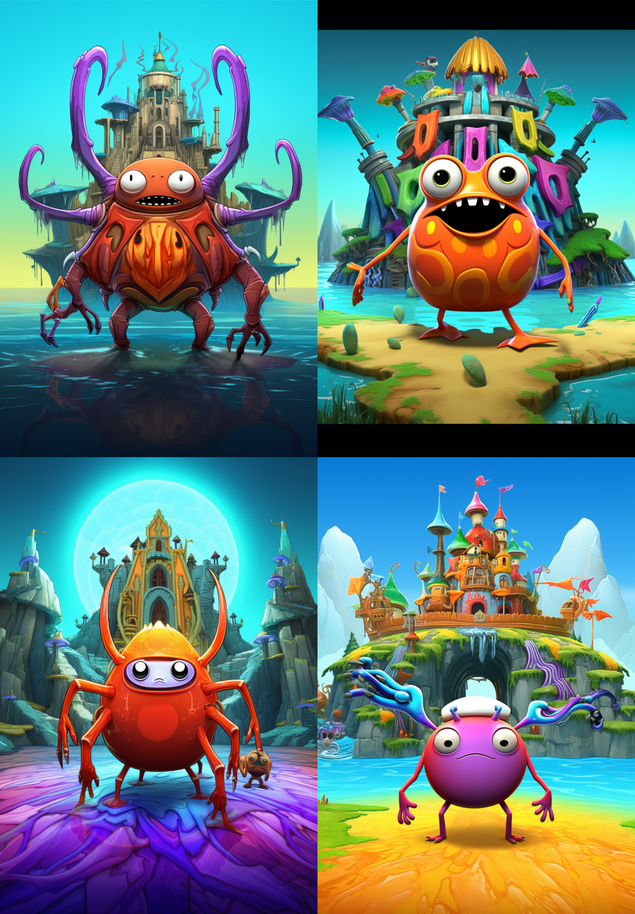
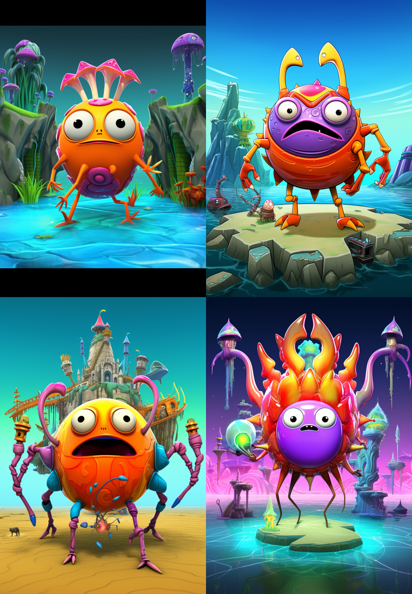
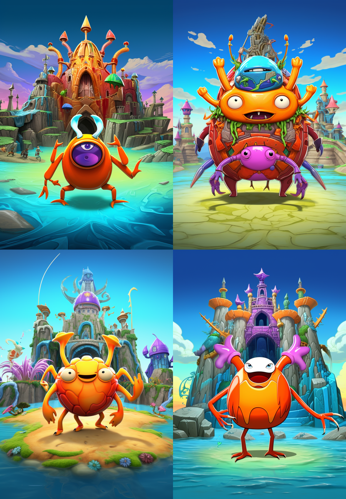

Realizing this approach was inefficient, I decided to limit the attempts to 10-15 generations for each animal. If I didn't get the desired result after this, I'd switch to another animal. This tactic proved more productive, but due to exhausting the hour limit on the Midjonery service, I had to invest an additional $4 to continue building my art collection.

### Final Notes

In three days of diligent work, spending several hours daily on experiments, and investing a total of $15, I managed to create quality art pieces for 15 animals. Many of our acquaintances, when testing the game, highly appreciated these images. Their astonishment was priceless when they found out that the arts were generated using a neural network. Despite the current technology limitations, with the right approach and persistence, one can achieve impressive results.

## Feedback on Developing Telegram's WebApp

### What We Appreciated

- Telegram's client uses modern webViews, which lets developers use the newest JS features without worries about compatibility.
- The "@twa-dev/types" package is very useful. It gives types for WebApp features and acts like a guide or reference.
- The WebApp API is easy to understand and use.
- The Telegram beta version has dev tools, making it easier to find and fix problems.
- Working with the WebApp was free of big problems. It felt like building a regular web site.

### Challenges Encountered

- We had some issues with cloud storage speed in the Telegram beta for macOS.
- Changing the style of the main and back buttons mainly uses JS, so we couldn't fully use CSS variables for theming
- The main button doesn't know HEX8 colors. We had to think of other ways to choose colors.
- To make sure everything works, we checked our designs in Safari. Looks like the macOS Telegram client uses Safari's engine.
- From tests with friends, we found that the Haptic Feedback doesn't always work. Some said they didn't feel any vibration.
- For some reason, web apps are not working at all on the Telegram client for Ubuntu.
